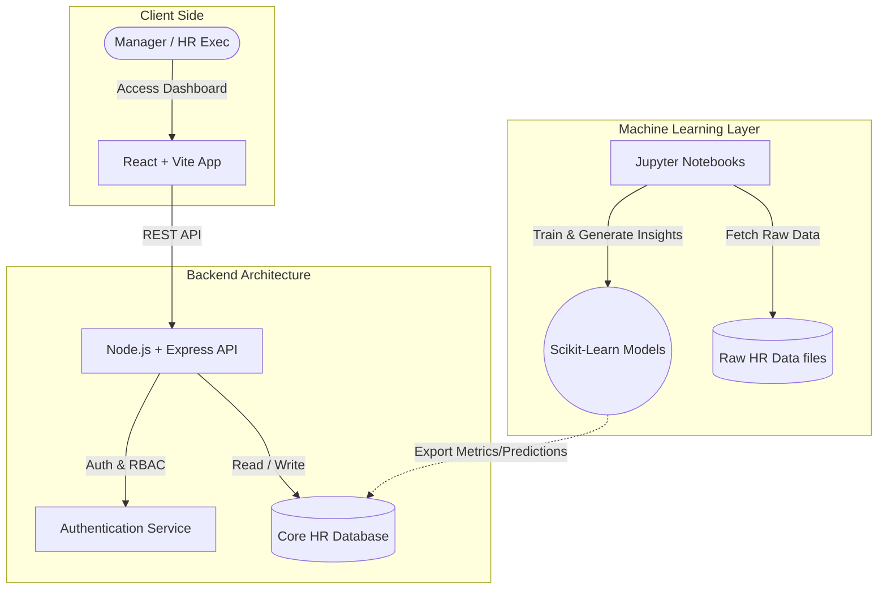

# 🧠 Humetrics: AI-Driven Workforce Intelligence

[](https://reactjs.org/)
[](https://nodejs.org/)
[](https://python.org/)

**Humetrics** is a cutting-edge HR Analytics and Workforce Management platform designed to transform raw human resources data into actionable, predictive intelligence. By integrating machine learning models with a robust Node.js backend and a beautiful, high-performance React frontend, Humetrics empowers HR professionals and business leaders to foresee attrition, detect behavioral risks, ensure pay equity, and strategically plan for workforce training and promotions.

Stop reacting to HR challenges. Start predicting them.

---

## ✨ Key Features

- 🔮 **Predictive Attrition & Retention**: Identify which employees are most likely to leave and understand the underlying drivers.
- ⚖️ **Pay Equity Analysis**: Automatically detect systemic compensation imbalances across gender, roles, and departments to ensure fair pay.
- 🎯 **Performance Forecasting**: Leverage historical data to predict employee success trajectories and optimize role matching.
- ⚠️ **Behavioral Risk Detection**: Flag potential compliance or cultural risks before they escalate.
- 📚 **Training Impact Optimization**: Measure the ROI of learning programs and identify where training interventions will be most effective.
- 🧠 **Smart Recommendation Engine**: Actionable AI-generated steps for managers regarding compensation reviews, career discussions, and interventions.
- 🔐 **Role-Based Access Control (RBAC)**: Secure access tailoring the dashboard views and data depending on whether the user is an HR Executive or a Department Manager.

---

## 🏗️ System Architecture

Humetrics is built on a modern, decoupled three-tier architecture:

1. **Frontend (Presentation Layer)**: A highly interactive UI built with React and Vite, fetching data securely from the backend.
2. **Backend (Application Layer)**: A Node.js/Express server that acts as the central hub. It orchestrates API requests, enforces RBAC, and serves data from the underlying database or interfaces with the generated ML insights.
3. **Machine Learning (Analytics Layer)**: A suite of Jupyter notebooks where predictive models are trained, evaluated, and outputted.



---

## 📂 Directory Structure

```text
humetrics/
├── backend/                  # Node.js + Express API server
│   ├── src/                  # Controllers, routes, and services
│   ├── package.json          # Backend dependencies
│   └── index.js              # Entry point for the server
├── frontend/                 # React + Vite application
│   ├── src/                  # Components, Contexts, Pages, API clients
│   ├── package.json          # Frontend dependencies
│   └── index.html            # App entry HTML
├── notebooks/                # Machine Learning workflows
│   ├── promotion.ipynb
│   ├── attrition_drivers.ipynb
│   ├── behavioral_risk.ipynb
│   ├── pay_equity.ipynb
│   ├── performance_prediction.ipynb
│   ├── recommendation_engine.ipynb
│   └── training_impact.ipynb
├── data/                     # Raw & processed CSVs and JSONs for ML
└── README.md                 # Project documentation
```

---

## 💻 Technology Stack

**Frontend**
*   **Framework:** React (Vite)
*   **Language:** TypeScript / JavaScript (JSX)
*   **Styling:** Tailwind CSS, Lucide Icons, Recharts
*   **State Management:** React Context API

**Backend**
*   **Runtime:** Node.js
*   **Framework:** Express.js
*   **Database:** MongoDB
*   **Security:** JSON Web Tokens (JWT), bcrypt

**Machine Learning & Data Science**
*   **Language:** Python 3
*   **Environment:** Jupyter Notebooks
*   **Libraries:** Pandas, NumPy, Scikit-learn, Matplotlib, Seaborn, SHAP

---

## 🔬 Machine Learning Models

The `/notebooks` directory houses the core intelligence of Humetrics. Each notebook handles a specific predictive or analytical HR task:

*   📈 **`Promotion.ipynb`**: Analyzes performance ratings, tenure, and training history to identify high-potential employees ready for leadership roles.
*   🚪 **`attrition_drivers.ipynb`**: Predicts churn probabilities and uses Explainable AI (XAI) with SHAP to isolate and explain the primary factors (e.g., pay stagnation, commute, manager relationship) driving turnover.
*   ⚠️ **`behavioral_risk.ipynb`**: Evaluates behavioral metadata and engagement metrics to flag burnout risk or disengagement patterns.
*   💵 **`pay_equity.ipynb`**: Runs statistical modeling across demographic groups to ensure compliance and fairness in compensation.
*   🌟 **`performance_prediction.ipynb`**: Forecasts future employee performance based on historical trends, engagement scores, and project success rates.
*   🤖 **`recommendation_engine.ipynb`**: The synthesis layer—processes outputs from other models to generate concrete action plans (e.g., "Schedule Compensation Review").
*   🎓 **`training_impact.ipynb`**: Correlates past training attendance with productivity spikes to optimize future L&D budgets.

---

## 🗄️ Database Design

The system relies on MongoDB, a NoSQL document database, to ensure flexible and scalable data storage for analytics. Key entities include:

*   **Users & Roles**: Manages authentication credentials and RBAC mapping.
*   **Employee Records**: Core HR data containing demographics, salaries, performance ratings, and tenure.
*   **Departments & Roles**: Organizational hierarchy and job classifications.
*   **Machine Learning Outputs**: Collections storing cached predictions (e.g., Burnout Risk Scores, Promotion Readiness) injected by the Jupyter notebooks.
*   **System Logs & Alerts**: Audit trails and automatically generated risk alerts for managers.

---

## 🔌 API Documentation

The Node.js backend exposes a RESTful API to serve the frontend. Standardized JSON responses are used across all endpoints. 

**Key Endpoints:**
*   `POST /api/auth/login`: Authenticate users and return a JWT.
*   `GET /api/dashboard/overview`: Fetch high-level KPIs (Total Employees, Average Salary, Turnover Rate).
*   `GET /api/employees`: Retrieve a paginated list of employees with sorting and filtering.
*   `GET /api/predictions/behavioral-risk`: Fetch the machine learning risk profiles for active employees.
*   `POST /api/upload`: Endpoint for HR to securely upload new batches of HR data CSVs.

*(A fully interactive Swagger/OpenAPI documentation will be available at `/api-docs` when running the backend in development mode).*

---

## 👥 User Roles & Permissions

Humetrics implements strict **Role-Based Access Control (RBAC)** to ensure sensitive HR data is protected:

*   **HR Executive / Admin**: Has global read/write access. Can view company-wide analytics, upload new data, and manage user accounts.
*   **Department Manager**: Has read-only access restricted strictly to employees within their own department. Cannot view system-wide pay equity or data from other managers.

---

## 🛡️ Security

Data privacy is paramount in HR analytics. Our security measures include:

*   **Authentication**: Stateless authentication using secure JSON Web Tokens (JWT).
*   **Password Hashing**: Passwords are never stored in plaintext (secured via `bcrypt`).
*   **Data Masking**: PII (Personally Identifiable Information) can be anonymized before being fed into the ML pipelines.
*   **Secure Routing**: Frontend routes and backend endpoints strictly enforce authorization checks before rendering UI or fulfilling requests.

---

## 🚀 Getting Started

Follow these steps to set up Humetrics locally on your machine.

### 1. Clone the Repository
```bash
git clone https://github.com/iiAhmedd/humetrics.git
cd humetrics
```

### 2. Set Up the Backend
```bash
cd backend
npm install
```

Create a `.env` file in the `backend` directory with your MongoDB Atlas connection string and JWT secrets:
```env
MONGO_URI=mongodb+srv://<username>:<password>@<cluster>.mongodb.net/<dbname>?retryWrites=true&w=majority
DB_NAME=hr_analytics
JWT_SECRET=your_super_secret_key
JWT_EXPIRES_IN=8h
PORT=8000
```

```bash
# Start the backend server
npm run start
```

### 3. Set Up the Frontend
Open a new terminal window:
```bash
cd frontend
npm install
# Start the Vite development server
npm run dev
```
Navigate to the `localhost` URL provided by Vite in your browser to view the application.

### 4. Explore the ML Notebooks
To run the analytics workflows, you need Python and Jupyter installed. We recommend using a virtual environment.
```bash
cd notebooks
python -m venv venv

# Activate the virtual environment:
# On Windows:
venv\Scripts\activate
# On macOS/Linux:
source venv/bin/activate

# Install requirements (if requirements.txt exists, otherwise install manually)
pip install jupyter pandas numpy scikit-learn matplotlib seaborn

# Launch Jupyter Notebook
jupyter notebook
```

---

## 🛣️ Future Enhancements

*   [ ] **Real-time Pipeline Integration**: Connect the Jupyter outputs to real-time event streams (e.g., Apache Kafka) for live updates.
*   [ ] **Generative AI Chatbot**: Implement an LLM-based assistant in the frontend so managers can chat directly with their workforce data.
*   [ ] **Advanced Bias Mitigation**: Add adversarial debiasing layers to the ML models to ensure 100% fair AI inferences.
*   [ ] **Mobile Optimization**: Build a React Native counterpart for on-the-go managers.

---
*Developed with ❤️ to empower organizations with ethical, data-driven workforce intelligence.*
